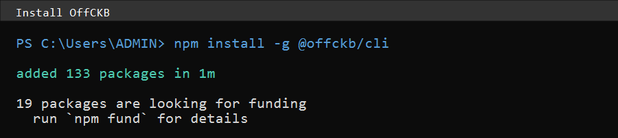
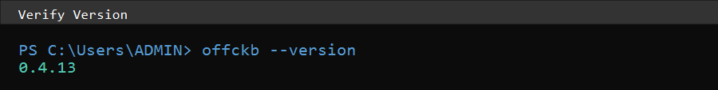
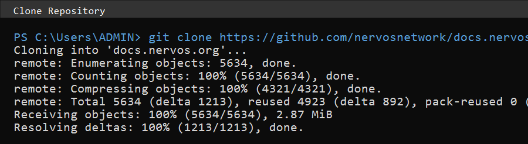
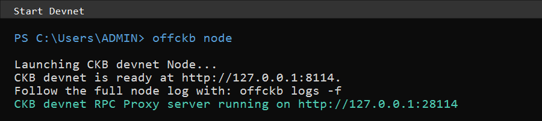
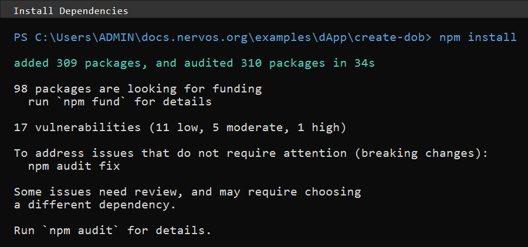
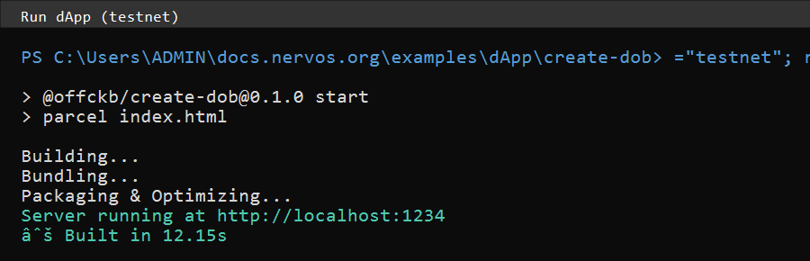
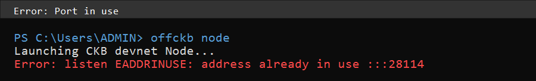
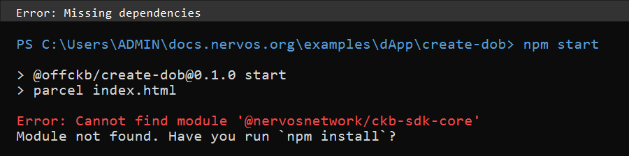

# CKB DOB Campaign Submission

Completed the ["Create a DOB"](https://docs.nervos.org/docs/dapp/create-dob) tutorial on CKB testnet.

## Transaction

| Network | Tx Hash | Explorer |
|---------|---------|----------|
| Testnet | `0xbe5e779e2955c2492fa01deadbb3a55a9358bc2c9660f7621ab3e1df8b1601f4` | [View on Explorer](https://explorer.nervos.org/testnet/transaction/0xbe5e779e2955c2492fa01deadbb3a55a9358bc2c9660f7621ab3e1df8b1601f4) |

## Screenshots

### UI - DOB Created on Testnet

### Terminal Outputs

| Step | Screenshot |
|------|------------|
| 1. Install OffCKB |  |
| 2. Verify Version |  |
| 3. Clone Repository |  |
| 4. Start Devnet |  |
| 5. Install Dependencies |  |
| 6. Run dApp (testnet) |  |
| 7. Error: Port in use |  |
| 8. Error: Missing deps |  |

## Files

- [README.md](README.md) - This file
- [REFLECTION.md](REFLECTION.md) - What I learned
- [Terminal_Outputs.md](Terminal_Outputs.md) - Raw terminal outputs
- [campaign_submission_final.md](campaign_submission_final.md) - Full submission
- [screenshots/](screenshots/) - All screenshots

## Checklist

- [x] OffCKB installed (v0.4.13)
- [x] Devnet running
- [x] DOB created with image via Spore-SDK
- [x] Image rendered from chain data
- [x] dApp on testnet
- [x] Real transaction hash captured
- [x] Screenshots taken
- [x] Reflection written

Done.
