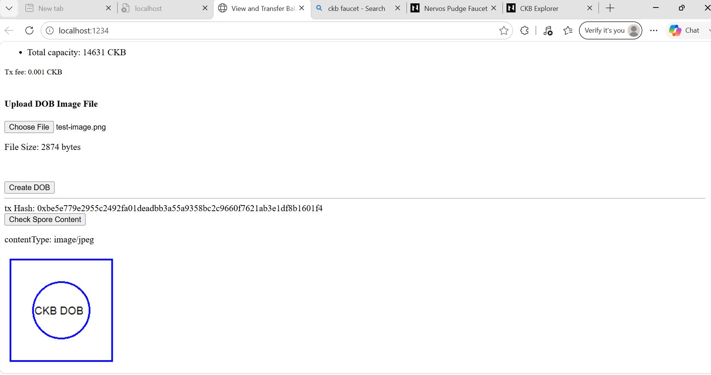

# CKB DOB Campaign Submission

Completed the ["Create a DOB"](https://docs.nervos.org/docs/dapp/create-dob) tutorial on CKB testnet.

## What Happened

OffCKB installed. Devnet running. Built the tutorial dApp. Uploaded a test image. Created a Spore DOB on-chain. Rendered it back in the browser. Switched to testnet.

```powershell
npm install -g @offckb/cli
offckb node
# CKB devnet RPC Proxy server running on http://127.0.0.1:28114

cd docs.nervos.org/examples/dApp/create-dob
npm install
$env:NETWORK="testnet"; npm start
# Server running at http://localhost:1234
```

## Transaction

| Network | Tx Hash | Explorer |
|---------|---------|----------|
| Testnet | `0xbe5e779e2955c2492fa01deadbb3a55a9358bc2c9660f7621ab3e1df8b1601f4` | [View on Explorer](https://explorer.nervos.org/testnet/transaction/0xbe5e779e2955c2492fa01deadbb3a55a9358bc2c9660f7621ab3e1df8b1601f4) |

## Screenshot



The image (a test PNG with "CKB DOB" text) was uploaded, stored on-chain as a Spore DOB, and rendered back from the blockchain data. The `contentType: image/jpeg` field shows the metadata stored alongside the image bytes in the cell.

## Reflection

The core difference between DOBs and NFTs: where the data lives. Traditional NFTs point to off-chain metadata hosted on IPFS or Arweave. A DOB stores the actual bytes in a CKB cell. My 2.8KB test image is sitting on-chain right now - not a hash of it, not a URL to it, the actual file.

You pay capacity for every byte. That's the trade-off. Permanence costs CKB. No pinning services to maintain, no gateways that could go down. The data is just... there, on the blockchain, as long as CKB exists.

The cell model is what makes this work. Each cell has capacity (pays for storage), a lock script (ownership), a type script (Spore protocol), and data (your content). Cleaner than NFT contracts where token logic, metadata, and storage are all tangled together in one Solidity contract.

One thing that surprised me: the content-type field. Spore doesn't care what you store. The tutorial uses `image/jpeg`, but you could put PDFs, videos, text, executables - anything that fits in the cell capacity. Opens up use cases beyond just collectibles.

Real use cases I thought about while doing this:
- Academic credentials on-chain - a university issues a diploma as a DOB, anyone can verify it with just the tx hash
- Legal timestamps - hash a contract, store it as a DOB, you've got a provable timestamp and the document content in one transaction
- Software distribution - store a binary as a DOB, users verify the content hash matches what they downloaded

The tutorial code was straightforward. `createSpore()` builds the transaction with the image bytes, signs it, sends it. `showSporeContent()` fetches the cell back, unpacks the data, returns the content type and bytes. The CCC SDK handles the RPC calls. OffCKB handles the devnet.

Errors I hit along the way:
- Port 28114 was already in use from a previous session - had to kill the old process
- Browserslist data was stale - ran `npx update-browserslist-db@latest`
- npm audit showed 17 vulnerabilities - none of them affected the tutorial code

## Checklist

- [x] OffCKB installed (v0.4.13)
- [x] Devnet running
- [x] DOB created with image via Spore-SDK
- [x] Image rendered from chain data
- [x] dApp on testnet
- [x] Real transaction hash captured
- [x] Screenshot taken
- [x] Reflection written

Done.
